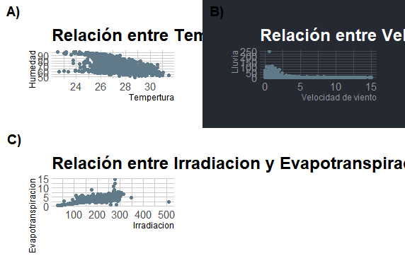

# Proyecto-01
# Andy Johel Valverde Ledezma
# C09291

## **Cargamos los paquetes:**
library(ggplot2)  
library(dplyr)  
library(hrbrthemes)  

## **Asigné un nombre al documento con el que voy a trabajar**
data_clima <- read.csv("liberia_datos_climaticos.csv",
                       sep = ",",
                       na.strings = "",
                       dec = ",")
                       
## **Revisé que no tuviera celdas vacías(NA)**
View(data_clima)

## **Realicé los histogramas**

### Histograma de temperatura
ggplot(data_clima, aes(x = Temperatura..Celsius.)) +
  geom_histogram(binwidth = 2,
                 color = "red",
                 fill = "white") +
  ggtitle("Temperatura en Liberia") +
  xlab("Temperatura(Celsius)") +
  ylab("Días")+
  theme_ipsum()

### Histograma de Humedad Relativa
ggplot(data_clima, aes(x = HumedadRelativa....)) +
  geom_histogram(binwidth = 2,
                 color = "red",
                 fill = "white") +
  ggtitle("Humedad Relativa en Liberia") +
  xlab("Humedad Relativa") +
  ylab("Días")+
  theme_ipsum_es()

  
### Histograma de Velocidad de viento
ggplot(data_clima, aes(x = VelocidadViento..m.s.)) +
  geom_histogram(binwidth = 2,
                 color = "yellow",
                 fill = "dark green") +
  ggtitle("Velocidad de viento en Liberia") +
  xlab("Velocidad de viento") +
  ylab("Días")+
  theme_ft_rc()

  
### Histograma de Lluvias
ggplot(data_clima, aes(x = Lluvia..mm.)) +
  geom_histogram(binwidth = 2,
          color = "pink",
          fill = "purple") +
  ggtitle("Lluvias en Liberia") +
  xlab("Lluvias") +
  ylab("Frecuencia")+       
  theme_ipsum_es()

  
### Histograma de Irradiacion
ggplot(data_clima, aes(x = Irradiacion..W.m2.)) +
  geom_histogram(binwidth = 2,
                 color = "orange",
                 fill = "brown") +
  ggtitle("Irradiacion en Liberia") +
  xlab("Iradiacion") +
  ylab("Frecuencia")+       
  scale_color_ipsum()

### Histograma de EvapoTranspiracion
ggplot(data_clima, aes(x = EvapoTranspiracion..mm.)) +
  geom_histogram(binwidth = 2,
                 color = "light blue",
                 fill = "blue") +
  ggtitle("EvapoTranspiracion en Liberia") +
  xlab("EvapoTranspiración") +
  ylab("Frecuencia")+       
  theme_ft_rc()

## **Unimos los histogramas**
F1<-grid.arrange(p6,p5,p4,p3,p2,p, nrow= 2)

## **Ahora realizaremos los graficos mensuales**

## **Ahora realizaremos graficos para relacionar las variables entre si**

### **Gráfico de dispersión de Temperatura y Humedad**

ggplot(data_clima, aes(x = Temperatura)) +
  geom_point(
    aes(y = Humedad)
  ) +
  ggtitle("Relación entre Temperatura y Humedad en la Liberia") +
  xlab("Tempertura") +
  ylab("Humedad") +
  theme_ipsum()

### **Gráfico de dispersión de velocidad de viento y lluvia**

ggplot(data_clima, aes(x = Viento)) +
  geom_point(
    aes(y = Lluvia)
  ) +
  ggtitle("Relación entre Velocidad de viento y Lluvia en Liberia") +
  xlab("Velocidad de viento") +
  ylab("Lluvia") +
  theme_ft_rc()
  

  
### **Gráfico de dispersión de Irradiacion y Evapotranspiracion**

ggplot(data_clima, aes(x = Irradiacion)) +
  geom_point(
    aes(y = Evapotrans)
  ) +
  ggtitle("Relación entre Irradiacion y Evapotranspiracion en Liberia") +
  xlab("Irradiacion") +
  ylab("Evapotranspiracion") +
  theme_ipsum()
  

## **Unimos los tres gráficos en uno**

ggpubr::ggarrange(r,r2,r3, labels = c("A)","B)","C)"))

